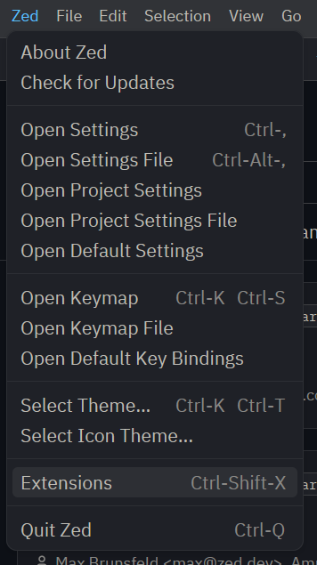
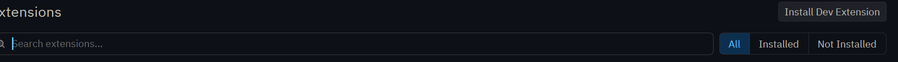
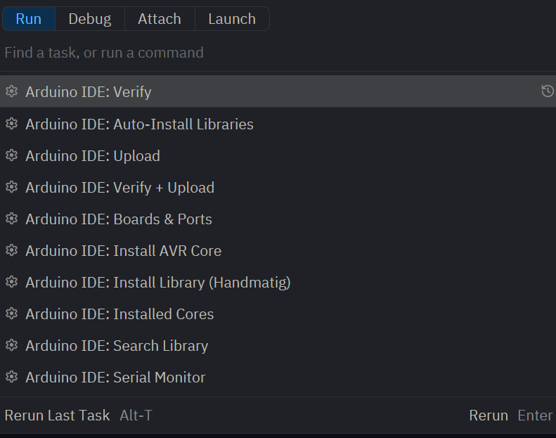
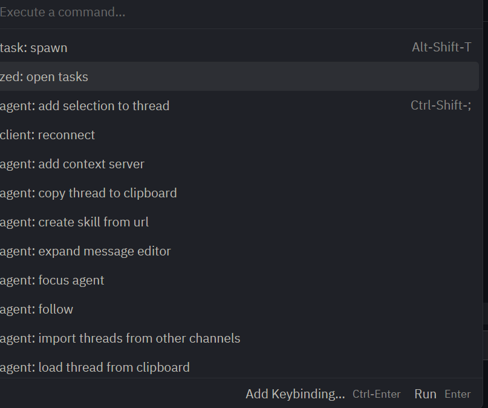

# 🚀 Zed Arduino Code

Gebruik Arduino rechtstreeks in de Zed editor met ondersteuning voor uploaden, libraries en automatische configuratie.

---

## 📌 Over het project

Dit project maakt het mogelijk om Arduino code te schrijven en te uploaden via de Zed editor in plaats van de standaard Arduino IDE.

Het ondersteunt:

* 📤 Uploaden van code naar je Arduino
* 📚 Automatisch en handmatig beheren van libraries
* ⚙️ Integratie met Arduino CLI

---

## 🧰 Vereisten

Zorg dat je het volgende hebt geïnstalleerd:

* Arduino board (bijv. Uno, Nano, etc.)
* Zed editor
* Arduino CLI

---

## ⚙️ Installatie

### 1. Installeer Arduino CLI

https://github.com/arduino/arduino-cli/releases

### 2. Installeer Zed

https://zed.dev/docs/installation

### 3. Installeer de extension

* Open Zed
* Ga naar **Extensions (Ctrl + Shift + X)**
* Klik op **Install Dev Extension**

---

## 🚀 Gebruik

### 🔧 Arduino taken openen

Open het command palette:

1. Druk op `Ctrl + Shift + P`
2. Typ: `task spawn`
3. Selecteer **task: spawn**

Daar zie je Arduino opties zoals:

* Upload
* Verify
* Libraries installeren
* Serial monitor

---

### 📤 Code uploaden

1. Druk op `Ctrl + Shift + P`
2. Kies **task: spawn**
3. Klik op **Arduino IDE: Upload**

---

### ⚙️ Boards & instellingen

Gebruik:

* **Arduino IDE: Boards & Ports** → om je board te kiezen
* Dit opent de Arduino instellingen

---

### 📂 Tasks configuratie

Gebruik:

* `zed: open tasks` → opent je `tasks.json`
* Hier kun je taken aanpassen of toevoegen
  

---

## 📚 Libraries

Je kunt libraries op twee manieren gebruiken:

* 🔍 **Search Library** (automatisch)
* ✍️ **Install Library (Handmatig)**

---

## 💡 Waarom dit project?

De standaard Arduino IDE is eenvoudig, maar beperkt.
Met dit project kun je werken in een modernere editor (Zed) met meer flexibiliteit.

---

## ⚠️ Opmerking

Arduino CLI moet correct geïnstalleerd zijn, anders werken de commands niet.

---

## 🤝 Bijdragen

Suggesties en verbeteringen zijn welkom!
Maak gerust een issue of pull request.

---

## 📄 Licentie

Nog toe te voegen.
